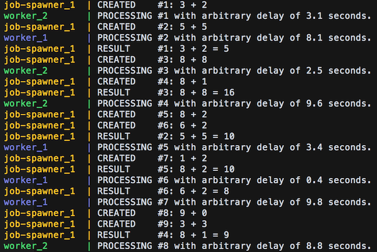

# Node.js beequeue example project

This is a simple example showcasing the excellent [beequeue](https://github.com/bee-queue/bee-queue) library.

`job-spawner` service creates random jobs every two seconds while `worker` service tries to clear the job queue.  

Run with `docker-compose up`.

Experiment with different scale values: `docker-compose up --scale worker=2`.

